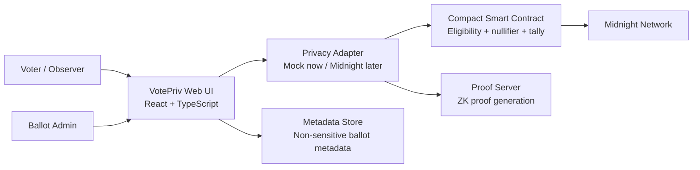
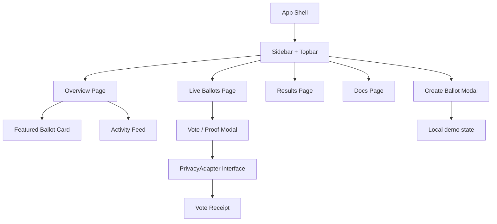
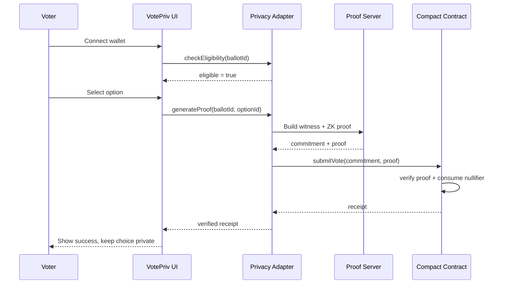
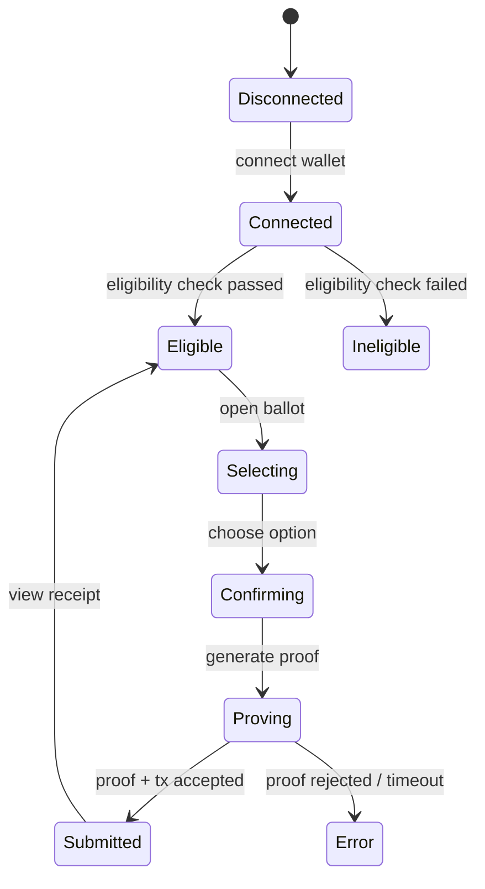

# VotePriv — Architecture

## 1. Tujuan Arsitektur

Arsitektur VotePriv memisahkan pengalaman pengguna, orkestrasi voting, dan privacy primitives agar frontend dapat didemokan dengan mock adapter hari ini dan dihubungkan ke Midnight tanpa perubahan besar pada user flow.

## 2. Diagram Konteks



## 3. Diagram Komponen Frontend



## 4. Layer dan Tanggung Jawab

| Layer | Tanggung jawab | Implementasi MVP |
| --- | --- | --- |
| Presentation | Render dashboard, form, states, responsive UI | React components dalam `Home.tsx` dan CSS design system |
| UI state | Active section, selected option, modal, proof progress | React `useState` |
| Domain model | Ballot, choice, receipt, activity | TypeScript types + mock data |
| Privacy adapter | `checkEligibility`, `generateProof`, `submitVote`, `getResults` | Mock functions dengan delay; interface siap diganti |
| Contract | Eligibility, commitment, nullifier, tally | Belum diakses pada prototype; target Compact |
| Network | Finality, state, transaction | Midnight testnet/mainnet pada fase integrasi |

## 5. Privacy Boundary

### Data privat

- Identitas asli voter dan credential payload.
- Choice individual sebelum dan sesudah tally.
- Witness yang digunakan untuk proof.
- Link langsung antara wallet dan pilihan.

### Data dapat diverifikasi publik

- Ballot id, metadata proposal, opsi, deadline.
- Proof valid/tidak valid.
- Nullifier sudah digunakan atau belum, tanpa membuka voter.
- Tally agregat dan status finalisasi.
- Transaction reference dan timestamp.

> Frontend tidak boleh menampilkan choice sebagai bagian dari activity log, URL, analytics event, atau metadata transaksi.

## 6. Domain Model

```ts
type BallotStatus = "live" | "closing-soon" | "finalized";

type Ballot = {
  id: string;
  title: string;
  description: string;
  community: string;
  options: { id: string; label: string; color: string }[];
  votes: number;
  eligible: number;
  quorum: number;
  deadline: string;
  status: BallotStatus;
  privacyLabel: "Choice hidden" | "Finalized";
};

type VoteReceipt = {
  ballotId: string;
  proofStatus: "verified" | "rejected";
  nullifierStatus: "consumed";
  txRef: string;
  submittedAt: string;
};
```

## 7. Contract Boundary yang Direncanakan

Interface frontend ke adapter:

```ts
interface PrivacyAdapter {
  connectWallet(): Promise<{ address: string; network: string }>;
  checkEligibility(ballotId: string): Promise<{ eligible: boolean }>;
  generateProof(input: {
    ballotId: string;
    optionId: string;
  }): Promise<{ commitment: string; proof: string }>;
  submitVote(input: {
    ballotId: string;
    commitment: string;
    proof: string;
  }): Promise<VoteReceipt>;
  getResults(ballotId: string): Promise<{
    counts: Record<string, number>;
    total: number;
    finalized: boolean;
  }>;
}
```

### Tanggung jawab Compact contract

1. Mendaftarkan root atau commitment eligibility.
2. Memvalidasi proof bahwa voter eligible.
3. Memastikan nullifier belum pernah digunakan.
4. Menyimpan commitment/encrypted vote state.
5. Menghasilkan tally agregat setelah finalisasi.
6. Mengekspos status proof, nullifier, dan hasil agregat untuk audit.

## 8. Alur Vote



## 9. State Machine UI



## 10. Deployment dan Integrasi

### Prototype saat ini

- Static React/Vite frontend.
- Mock domain state di browser.
- Tidak menyimpan private key, credential, atau data voter.
- Form create ballot bersifat lokal untuk kebutuhan demo.

### Produksi yang disarankan

- Frontend tetap static.
- Metadata ballot non-sensitif disimpan di backend/database.
- Proof generation memakai proof server yang dipisahkan dari UI.
- Wallet adapter dan Compact contract menjadi satu-satunya jalur transaksi.
- Monitoring hanya mencatat latency, status proof, dan tx reference; jangan log witness/choice.

## 11. Keamanan

- Gunakan HTTPS dan wallet provider resmi.
- Jangan pernah mengirim private key ke server.
- Gunakan nullifier domain-separated per ballot.
- Validasi deadline di contract, bukan hanya di frontend.
- Gunakan anti-replay binding pada ballot id dan election root.
- Jangan mengandalkan hidden UI sebagai kontrol akses.

## 12. Observability dan Testing

### Test utama

- Unit test reducer/state machine voting.
- Contract test: invalid proof, reused nullifier, expired ballot.
- E2E: connect → eligible → select → prove → receipt.
- Responsive smoke test 375px dan 1280px.

### Observability aman

- `proof_started`, `proof_verified`, `proof_rejected` tanpa option id.
- Latency proof generation.
- Transaction finality duration.
- Error category tanpa payload privat.

## 13. Keputusan Teknis MVP

- **Web static** dipilih karena kebutuhan awal adalah UX demo dan tidak ada backend produksi.
- **Mock adapter** menjaga komponen UI tidak bergantung pada API yang belum tersedia.
- **Dark civic-tech visual system** menekankan trust, cryptographic proof, dan auditability.
- Semua demo data bersifat sintetis.
