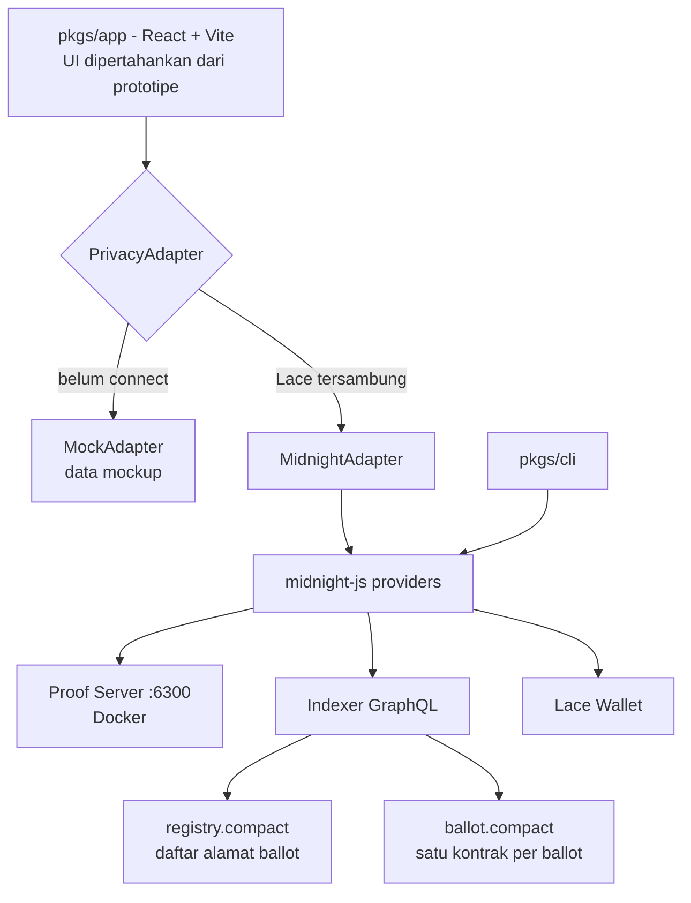

# VotePriv di Midnight — Desain Teknis

Tanggal: 2026-09-10
Status: disetujui untuk masuk tahap rencana implementasi
Dokumen induk: [`docs/ARCHITECTURE.md`](../../ARCHITECTURE.md)

## 1. Tujuan

Mengubah prototipe VotePriv (React/Vite, data mock) menjadi aplikasi voting privat yang benar-benar berjalan di Midnight testnet, tanpa mengubah desain visual dan struktur informasi frontend yang sudah ada.

Sifat yang harus dipertahankan dari `ARCHITECTURE.md`:

- Voter membuktikan dirinya berhak memilih tanpa membuka identitas.
- Pilihan individual bersifat privat **sebelum maupun sesudah** tally.
- Nullifier mencegah suara ganda, tanpa membuka siapa pemilihnya.
- Hanya tally agregat, status proof, dan status finalisasi yang publik.

## 2. Keputusan desain

Empat keputusan yang menentukan bentuk seluruh sistem, beserta alasannya.

### 2.1 Tally dua fase: commit lalu buka

**Masalahnya:** ledger Midnight bersifat publik. Bila kontrak melakukan `tally[opsi].increment(1)` saat voter mencoblos, delta state pada transaksi itu langsung membocorkan pilihan si voter. Ini persis alasan contoh resmi Rock-Paper-Scissors memakai commit/reveal, bukan penghitungan langsung.

**Keputusan:** fase vote hanya menulis nullifier dan commitment; pembukaan dan penghitungan terjadi di fase kedua setelah deadline, memakai nullifier kedua yang diturunkan dari salt rahasia sehingga tidak bisa dihubungkan kembali ke commitment mana pun.

**Ditolak:** tally langsung satu fase (bocor pilihan per nullifier); coordinator ala MACI (menambah pihak yang harus dipercaya untuk privasi, plus infrastruktur off-chain).

### 2.2 Eligibility lewat credential + Merkle tree

**Masalahnya:** kontrak tidak bisa memverifikasi bahwa pemanggil benar-benar memiliki alamat wallet yang diklaimnya — tidak ada pengecekan tanda tangan yang tersedia di dalam circuit. Sementara itu, kunci rahasia yang dibuat sendiri oleh browser tidak tahan sybil: satu orang bisa membuat sebanyak mungkin.

**Keputusan:** admin membuat satu credential acak 32 byte per voter saat ballot dibuat. Kontrak menyimpan Merkle tree berisi hash credential tersebut. Voter membuktikan credential-nya ada di dalam tree secara ZK, dan nullifier diturunkan dari credential — bukan dari kunci browser. Satu credential = satu suara.

**Ditolak:** self-enrollment on-chain (menambah satu transaksi per voter dan tetap tidak tahan sybil); tanpa allowlist (menghapus tanggung jawab kontrak poin 1 dan 2 di `ARCHITECTURE.md` §7).

### 2.3 Penemuan ballot sepenuhnya on-chain

**Keputusan:** satu registry contract menyimpan daftar alamat kontrak ballot; metadata ballot (judul, deskripsi, opsi, deadline) disimpan di dalam kontrak ballot itu sendiri sebagai `Opaque<"string">` yang di-`sealed` saat deploy. Tidak ada backend dan tidak ada basis data.

**Konsekuensi:** metadata ikut jadi data yang bisa diaudit publik, sejalan dengan `ARCHITECTURE.md` §5 yang memang mendaftarkannya sebagai data publik. Biayanya: jumlah opsi dibatasi tetap (maksimum 4) dan setiap pembuatan ballot memerlukan dua transaksi (deploy + daftar ke registry).

### 2.4 Data demo lewat pertukaran adapter

**Masalahnya:** frontend menampilkan 842 dari 1.200 suara, 4.286 verified votes, 12 active ballots. Membuat angka itu nyata membutuhkan ribuan transaksi berikut proof ZK dan DUST — tidak mungkin di testnet.

**Keputusan:** selama wallet belum tersambung, UI dijalankan `MockAdapter` dan menampilkan angka mockup apa adanya, diberi badge `Demo data` yang jelas. Begitu Lace tersambung, adapter bertukar ke `MidnightAdapter` dan seluruh angka berasal dari on-chain.

**Ditolak:** menanam `seedVotes` di kontrak. Pada aplikasi yang seluruh nilai jualnya adalah auditability, menerbitkan angka yang tidak berasal dari suara siapa pun justru merusak klaim utamanya, dan itu terlihat oleh siapa saja yang membaca ledger.

### 2.5 Gating berbasis saldo token

**Masalahnya:** pada Kernel Midnight, `balance()` / `balanceGreaterThan()` / `balanceLessThan()` mengukur saldo kontrak itu sendiri, `self()` mengembalikan alamat kontrak, dan tidak ada mekanisme apa pun bagi circuit untuk membaca saldo maupun alamat wallet pemanggil. Pola `balanceOf(msg.sender) >= X` ala Ethereum karena itu tidak dapat diterjemahkan. Ini konsekuensi langsung dari desain chain-nya: seandainya kontrak bisa mengetahui siapa pemanggilnya dan berapa saldonya, jaminan privasi voting runtuh sejak awal.

**Keputusan:** gating berbasis saldo diperlakukan sebagai **kebijakan penerbitan credential**, bukan logika kontrak. Admin mengambil snapshot pemegang token pada block tertentu, lalu menerbitkan credential hanya kepada yang memenuhi syarat. Kontraknya tidak berubah sedikit pun. Aturannya ditulis on-chain pada `eligibilityPolicy` sehingga terbaca publik dan dapat diaudit.

**Ditolak:** mengunci token di kontrak sebagai bukti kepemilikan — memang menghapus peran admin, tapi penanganan coin adalah bagian tersulit di Compact, menuntut jalur refund setelah ballot selesai, dan memaksa voter memindahkan token. Juga ditolak: voting berbobot token — bobot ikut terlihat saat tally, sehingga pemegang saldo yang khas langsung terbongkar begitu ada tally yang menambah tepat sejumlah itu; ini hanya aman bila bobot dibulatkan kasar, yang justru menghilangkan gunanya.

## 3. Arsitektur sistem



Satu kontrak per ballot bukan pilihan gaya: `MerkleTree` adalah ADT ledger tingkat-atas dan tidak dapat di-nest ke dalam `Map`, sehingga registry tunggal yang memuat banyak ballot tidak bisa dibangun.

## 4. Kontrak: `registry.compact`

Direktori permissionless. Sekali deploy, alamatnya menjadi konstanta di `pkgs/shared`.

```compact
pragma language_version >= 0.16 && <= 0.22;
import CompactStandardLibrary;

export ledger ballots: List<Opaque<"string">>;   // alamat kontrak, terbaru di depan
export ledger count:   Counter;

export circuit register(addr: Opaque<"string">): [] {
  ballots.pushFront(disclose(addr));
  count.increment(1);
}
```

`pushFront` menaruh yang terbaru di depan, cocok dengan perilaku UI sekarang yang memasang ballot baru di urutan pertama. Siapa pun boleh mendaftar; entri yang tidak resolve ke kontrak ballot yang sah disaring di sisi klien.

## 5. Kontrak: `ballot.compact`

### 5.1 Ledger

```compact
export enum BallotPhase { voting, tallying, finalized }

// metadata, di-seal saat deploy
export sealed ledger title:         Opaque<"string">;
export sealed ledger description:   Opaque<"string">;
export sealed ledger community:     Opaque<"string">;
export sealed ledger option0:       Opaque<"string">;
export sealed ledger option1:       Opaque<"string">;
export sealed ledger option2:       Opaque<"string">;
export sealed ledger option3:       Opaque<"string">;
export sealed ledger optionCount:   Uint<8>;      // 2..4
export sealed ledger voteDeadline:  Uint<64>;     // DETIK sejak epoch Unix
export sealed ledger tallyDeadline: Uint<64>;     // DETIK sejak epoch Unix
export sealed ledger quorumPercent: Uint<8>;     // informatif, TIDAK ditegakkan circuit mana pun
export sealed ledger eligibleCount: Uint<64>;
export sealed ledger eligibilityPolicy: Opaque<"string">;   // aturan penerbitan credential, dapat diaudit
export sealed ledger adminKey:      Bytes<32>;
export sealed ledger ballotNonce:   Bytes<32>;    // pemisah domain nullifier per ballot

// eligibility
export ledger eligibility: MerkleTree<10, Bytes<32>>;   // hash credential, sampai 1024 voter

// fase vote — tidak memuat satu bit pun informasi tentang pilihan
export ledger nullifiers:  Set<Bytes<32>>;
export ledger commitments: MerkleTree<10, Bytes<32>>;
export ledger voteCount:   Counter;

// fase tally
export ledger tallyNullifiers: Set<Bytes<32>>;
export ledger tallies:         Map<Uint<8>, Uint<64>>;
export ledger talliedCount:    Counter;
export ledger phase:           BallotPhase;
```

Field `accent`, `tag`, `status`, dan `privacyLabel` yang ada di tipe `Ballot` frontend **tidak** disimpan on-chain — semuanya diturunkan di klien dari `phase`, deadline, dan hash alamat kontrak.

### 5.2 Witness

```compact
witness voter_credential():                        Bytes<32>;
witness eligibility_path():                        MerkleTreePath<10, Bytes<32>>;
witness commitment_path():                         MerkleTreePath<10, Bytes<32>>;
witness get_my_option():                           Uint<8>;
witness get_my_salt():                             Bytes<32>;
witness store_opening(o: Uint<8>, s: Bytes<32>):   [];
witness admin_secret_key():                        Bytes<32>;
```

Sesuai pelajaran dari contoh RPS: lapisan witness adalah penyimpan lokal yang bodoh. Seluruh aturan ditegakkan oleh `assert` di dalam circuit, tidak pernah oleh TypeScript.

### 5.3 Fungsi hash — pemisahan domain

Setiap hash memakai prefiks berbeda supaya nilai dari satu keperluan tidak bisa dipakai untuk keperluan lain.

| Nilai | Rumus |
|---|---|
| Daun eligibility | `H([pad(32,"votepriv:cred:v1"), credential])` |
| Nullifier vote | `H([pad(32,"votepriv:nf:v1"), ballotNonce, credential])` |
| Commitment vote | `H([pad(32,"votepriv:vote:v1"), optionBytes, salt])` |
| Nullifier tally | `H([pad(32,"votepriv:tnf:v1"), salt])` |
| Kunci admin | `H([pad(32,"votepriv:pk:v1"), adminSecretKey])` |

`H` adalah `persistentHash<Vector<n, Bytes<32>>>`.

### 5.4 `constructor` dan `registerVoters()`

`constructor` menerima metadata, `Vector<16, Bytes<32>>` berisi hash credential beserta jumlahnya, lalu menyemai `eligibility` dan menyetel `adminKey = H(pad(32,"votepriv:pk:v1"), admin_secret_key())`. Ballot dengan sampai 16 pemilih karenanya selesai dalam satu transaksi deploy.

Untuk ballot yang lebih besar, `registerVoters(hashes: Vector<8, Bytes<32>>, n: Uint<8>)` menambahkan hingga delapan daun sekaligus. Circuit ini khusus admin — `assert(H(pad(32,"votepriv:pk:v1"), admin_secret_key()) == adminKey)` — dan hanya boleh dipanggil sebelum `voteDeadline`, sehingga daftar pemilih tidak dapat diubah di tengah pemungutan suara. Kapasitas tree adalah 1024 daun.

Kedua jalur menegakkan `assert(eligibility.firstFree() + n <= eligibleCount)`. Karena `firstFree()` bersifat publik, siapa pun dapat membandingkan jumlah credential yang benar-benar diterbitkan dengan `eligibleCount` yang di-seal — dan kontraklah yang menolak kelebihannya, bukan sekadar membuatnya terlihat. Admin tidak dapat diam-diam menyelipkan pemilih tambahan.

Bila menyemai tree di dalam constructor ternyata tidak didukung compiler, jalur mundurnya adalah menyerahkan seluruh pendaftaran ke `registerVoters` yang dipanggil setelah deploy.

### 5.5 `castVote()`

1. `assert(kernel.blockTimeLessThan(voteDeadline))` — deadline ditegakkan di kontrak, bukan hanya di UI (`ARCHITECTURE.md` §11). **Satuannya detik sejak epoch Unix, bukan milidetik.** Kernel membandingkan terhadap `secondsSinceEpoch` apa adanya, tanpa penskalaan, sehingga deadline yang diisi dalam milidetik menghasilkan angka sekitar seribu kali terlalu besar: perbandingannya nyaris selalu benar dan pemungutan suara tidak pernah tertutup. Simulator dapat menyuntikkan waktu blok sehingga ujinya tetap hijau dengan satuan mana pun — node sungguhan tidak bisa, jadi kekeliruan ini baru terlihat di jaringan nyata.
2. Hitung `credHash` dari `voter_credential()`; pastikan `eligibility_path()` berdaun `credHash` dan `assert(eligibility.checkRoot(merkleTreePathRoot(path)))`.
3. Hitung `nf`; `assert(!nullifiers.member(nf))`; `nullifiers.insert(disclose(nf))`.
4. Hitung `c` dari `get_my_option()` dan `get_my_salt()`; `commitments.insert(disclose(c))`; `voteCount.increment(1)`.
5. `store_opening(option, salt)` — disimpan lokal untuk fase tally.

Yang terlihat publik: satu nullifier terpakai, satu commitment bertambah, hitungan naik satu. Nol informasi tentang pilihan.

### 5.6 `tallyVote()`

1. `assert(kernel.blockTimeGreaterThan(voteDeadline))` dan `assert(kernel.blockTimeLessThan(tallyDeadline))`.
2. Hitung ulang `c` dari opening; `assert(commitments.checkRoot(merkleTreePathRoot(commitment_path())))` dengan daun `c`.
3. Hitung `tnf`; `assert(!tallyNullifiers.member(tnf))`; masukkan.
4. `tallies[option] += 1`; `talliedCount.increment(1)`.

Karena `tnf` diturunkan dari salt yang rahasia, publik melihat "ada satu suara untuk opsi X" tanpa dapat menghubungkannya ke commitment mana pun. Pilihan tetap tidak bisa dilacak ke voter, bahkan setelah hasil terbit.

### 5.7 `finalize()`

Terbuka untuk siapa saja setelah `tallyDeadline` lewat; menyetel `phase = finalized`. Memberi tanda finalitas yang eksplisit di on-chain, bukan sekadar turunan waktu di UI.

Permissionless di sini adalah keputusan, bukan kelalaian. `finalize` tidak memindahkan nilai apa pun dan tidak melonggarkan satu pun guard: setiap circuit yang dijaga `phase != finalized` juga dijaga batas waktu yang sudah lewat ketika `finalize` bisa dipanggil, sehingga memanggilnya tidak memberi orang luar apa pun yang tidak bisa mereka peroleh dengan menunggu. Sebaliknya, menerima `phase == voting` justru yang mencegah ballot yang tak pernah dibuka siapa pun terkunci selamanya.

**`quorumPercent` tidak ditegakkan.** Ia disimpan sebagai niat yang dinyatakan pembuat ballot dan tidak dibaca circuit mana pun: ballot difinalisasi pada partisipasi 0% persis seperti pada 100%. Menegakkannya akan menuntut keadaan akhir tersendiri untuk ballot yang gagal kuorum, karena `finalize` yang menolak akan membuatnya tersangkut selamanya — jebakan liveness yang sama yang sudah dua kali dihindari desain ini. Konsekuensinya mengikat tampilan: UI dan halaman Docs wajib menyebutnya sebagai ambang yang dinyatakan komunitas, bukan syarat yang dijamin kontrak.

## 6. Analisis privasi

### 6.1 Yang tidak pernah menyentuh ledger

Credential, kunci rahasia, salt, pilihan pada fase vote, dan Merkle path — seluruhnya hanya ada sebagai witness di dalam private state lokal.

### 6.2 Ketidakterhubungan

| Kaitan | Dilindungi oleh |
|---|---|
| daun eligibility → nullifier vote | prefiks domain berbeda; keduanya preimage dari credential |
| nullifier vote → commitment | keduanya ditulis dalam satu transaksi, tapi commitment tidak memuat informasi opsi apa pun sampai dibuka |
| commitment → nullifier tally | keduanya butuh salt 32 byte acak; menghubungkannya berarti membalik `persistentHash` |
| nullifier tally → identitas voter | pengirim transaksi kontrak di Midnight ter-shield |

### 6.3 Batasan yang diketahui

Ini harus disebut apa adanya di halaman Docs aplikasi, bukan disembunyikan.

- **Suara yang tidak dibuka tidak terhitung.** Voter harus kembali setelah deadline untuk menjalankan `tallyVote()`. Selisihnya terlihat publik sebagai `voteCount - talliedCount` sehingga tetap bisa diaudit, tapi tetap merupakan biaya nyata dari desain dua fase.
- **Kehilangan private state berarti kehilangan suara.** Bila penyimpanan lokal terhapus sebelum tally, opening ikut hilang. Mitigasi: layar sukses menawarkan pencadangan opening.
- **Korelasi waktu dan jaringan.** Bila hanya satu orang melakukan tally dalam satu rentang waktu, pengamat tingkat jaringan bisa menduga kaitannya. Di luar jangkauan kontrak.
- **Proof server melihat witness.** Ia yang membangun ZK proof, jadi ia menerima credential dan pilihan suara dalam bentuk terbuka. Proof server lokal menjaga hal itu tidak pernah meninggalkan perangkat pemilih. Proof server remote yang dioperasikan pihak lain berarti operatornya dapat melihat setiap suara — klaim privasi aplikasi ini tidak berlaku terhadap dirinya. Karena itu default-nya lokal, dan mode remote wajib ditandai terang-terangan di UI, bukan hanya disebut di berkas konfigurasi.
- **Admin dipercaya menerbitkan credential kepada orang yang tepat.** Model kepercayaan ini sama dengan voting ber-allowlist mana pun. Yang tetap ditegakkan kontrak: jumlah credential tidak boleh melebihi `eligibleCount` yang di-seal dan dapat dicek siapa pun lewat `firstFree()`, satu credential hanya bisa dipakai sekali, dan pihak di luar tree tidak bisa memilih sama sekali. Admin mengetahui siapa saja yang berhak, tapi tidak pernah mengetahui pilihan siapa pun.

## 7. Struktur repo

Monorepo mengikuti pola RPS, tetap memakai pnpm karena repo ini sudah punya lockfile dan patch `wouter`.

```
pkgs/contract   ballot.compact, registry.compact, witnesses, tes simulator Vitest
pkgs/shared     tipe domain, endpoint jaringan, hash berpemisah domain, pembuat credential
pkgs/cli        deploy registry & ballot, terbitkan credential, uji end-to-end headless
pkgs/app        isi client/ sekarang, dipindah utuh
```

`server/index.ts` menyusut jadi proxy `/proof-server` saja. Browser tidak boleh mem-fetch `127.0.0.1:6300` langsung: service worker Lace memotong seluruh fetch tingkat halaman dan Chrome memblokir permintaan ke `127.0.0.1` dari konteks tersebut. Jalur same-origin diteruskan Node di sisi server.

Artefak ZK (`keys` dan `zkir`) dikompilasi sekali lalu disalin ke `pkgs/app/public/managed/{ballot,registry}/`, dan bersifat independen terhadap jaringan — berpindah jaringan tidak pernah menuntut kompilasi ulang.

## 8. Batas PrivacyAdapter

`ARCHITECTURE.md` §7 menetapkan `PrivacyAdapter` sebagai batas antara UI dan lapisan privasi. Batas itu dipertahankan, dengan dua penyimpangan yang perlu dicatat:

- `generateProof` dan `submitVote` dilebur menjadi `castVote`. Di midnight-js, pembuatan proof dan pengiriman transaksi adalah satu operasi `callTx` yang tak terpisahkan; memisahkannya hanya akan jadi pemisahan palsu.
- Ditambahkan `tallyVote`, `createBallot`, dan `listBallots`, yang menjadi keharusan setelah keputusan §2.1 dan §2.3.

```ts
interface PrivacyAdapter {
  connectWallet(): Promise<{ address: string; network: string }>;
  listBallots(): Promise<Ballot[]>;
  getBallot(id: string): Promise<Ballot>;
  checkEligibility(ballotId: string, credential: string): Promise<{ eligible: boolean; reason?: string }>;
  castVote(input: { ballotId: string; optionId: number; credential: string }): Promise<VoteReceipt>;
  tallyVote(input: { ballotId: string }): Promise<VoteReceipt>;
  getResults(ballotId: string): Promise<BallotResults>;
  createBallot(input: CreateBallotInput): Promise<{ ballotId: string; credentials: string[] }>;
}
```

Dua implementasi: `MockAdapter` (perilaku prototipe sekarang; dipakai sebelum wallet tersambung dan pada tes UI) dan `MidnightAdapter`. Komponen UI tidak perlu tahu bedanya.

Bentuk private state:

```ts
type VotePrivPrivateState = {
  secretKey:   Uint8Array;                                     // identitas admin
  credentials: Record<string, Uint8Array>;                     // alamat ballot -> credential
  openings:    Record<string, { option: number; salt: Uint8Array }>;
};
```

Disimpan lewat `levelPrivateStateProvider`, dipisahkan per `networkId` agar state dari satu jaringan tidak bocor ke jaringan lain.

## 9. Perubahan UI

### 9.1 Yang dipertahankan apa adanya

Keempat section, sidebar, topbar, seluruh `index.css`, kartu ballot, modal vote tiga tahap, modal create, tabel hasil, halaman docs.

Tiga langkah pada tahap "proving" kini menjadi operasi nyata, bukan `setTimeout`:

| Langkah di UI | Operasi nyata |
|---|---|
| Eligibility checked | Merkle path disusun dari tree on-chain |
| Generating proof | proof ZK di proof server, 5–20 detik |
| Submitting receipt | transaksi dikirim; `txRef` adalah id transaksi asli |

### 9.2 Yang berubah

1. **Connect wallet** memakai Lace. Alamat berbentuk `mn_shield-addr_test1…`; `shortAddress()` tetap berfungsi.
2. **Field credential** pada tahap select di modal vote, atau dibaca otomatis dari `?cred=` pada tautan undangan.
3. **Create ballot** menjadi deploy sungguhan: terbitkan credential, deploy kontrak, daftarkan ke registry. Memakai ulang visual tahap "proving", dan menampilkan daftar credential untuk dibagikan.
4. **Aksi "Buka suara Anda"** di halaman Results untuk ballot yang sudah lewat deadline dan opening-nya masih tersimpan.
5. **Kartu network status** memakai block height asli dari indexer.
6. **Badge `Demo data`** saat `MockAdapter` aktif.
7. **Halaman Docs** mempertahankan desain, tapi teksnya diperbarui agar menjelaskan kontrak yang sebenarnya, termasuk batasan pada §6.3.
8. **Pencadangan opening** pada layar sukses, agar suara tidak hangus bila penyimpanan lokal terhapus.

### 9.3 Pemecahan `Home.tsx`

`Home.tsx` memuat seluruh halaman dan modal dalam satu berkas dengan JSX yang sangat padat. Karena vote, tally, dan create kini membawa state asinkron dan penanganan error yang nyata, berkas ini dipecah menjadi `components/votepriv/{Overview,LiveBallots,Results,Docs,BallotCard,VoteModal,CreateBallotModal}.tsx`. Markup dan nama kelas CSS dipindahkan satu banding satu — pemecahan ini murni struktural, tidak menyentuh tampilan.

### 9.4 Pemetaan data UI ke on-chain

| Elemen UI | Sumber saat `MidnightAdapter` aktif |
|---|---|
| Daftar ballot | `registry.ballots`, tiap alamat di-query state kontraknya |
| Judul, deskripsi, komunitas, opsi | field `sealed` pada kontrak ballot |
| `votes` di kartu ballot | `voteCount` |
| `eligible` | `eligibleCount` |
| `quorum` | `quorumPercent` — **informatif, bukan ambang yang dijamin kontrak**; UI wajib menyebutnya sebagai niat yang dinyatakan pembuat ballot |
| Keterangan siapa yang berhak | `eligibilityPolicy`, tampil di kartu ballot dan modal vote |
| `deadline` | `voteDeadline` |
| `status` (`live` / `closing-soon` / `finalized`) | `phase` digabung sisa waktu menuju `voteDeadline` |
| `accent`, `tag` | diturunkan di klien dari hash alamat dan `phase` |
| Metrik "Active ballots" | cacah ballot dengan `phase != finalized` |
| Metrik "Verified votes" | jumlah `voteCount` seluruh ballot |
| Metrik "Privacy score" | tetap 100 — tidak pernah ada pilihan yang terbuka; ini pernyataan desain, bukan hasil pengukuran |
| Kartu network status | block height dan waktu finality dari indexer |
| Recent activity | perubahan terbaru pada `voteCount`, `talliedCount`, dan `registry.count` |
| Persentase di halaman Results | `tallies` — baru terisi setelah fase tally |

Satu perilaku yang perlu ditegaskan: selama `phase == voting`, `tallies` masih kosong, karena memang tidak boleh ada isinya. Halaman Results karena itu menampilkan keadaan tersegel — bar hasil diganti keterangan "Hasil tersegel sampai deadline" dengan gaya visual yang sama — dan baru menampilkan persentase setelah fase tally berjalan. Ini bukan kekurangan tampilan, melainkan wujud terlihat dari jaminan privasinya.

## 10. Strategi pengujian

1. **Simulator kontrak (Vitest, tanpa jaringan).** Mengikuti pola `rps-simulator.ts`. Kasus wajib: voter eligible berhasil; non-eligible ditolak; suara ganda ditolak nullifier; vote setelah deadline ditolak; tally sebelum deadline ditolak; tally ganda ditolak; commitment tidak cocok ditolak; opsi di luar `optionCount` ditolak; total tally sama dengan jumlah opening yang dibuka.
2. **End-to-end lewat CLI di testnet.** Deploy registry dan satu ballot, terbitkan tiga credential, tiga voter dengan private state terpisah mencoblos, lewati deadline, tally, periksa hitungan akhir. Ini bukti nyata bahwa rangkaiannya berjalan.
3. **UI.** `MockAdapter` menjaga UI tetap bisa diuji tanpa wallet maupun proof server; smoke test responsif pada 375px dan 1280px sesuai `ARCHITECTURE.md` §12.

Waktu blok **dapat** dikendalikan di dalam simulator: `createCircuitContext` menerima waktu sebagai parameter posisional ketujuh, dalam detik sejak epoch. Rencana mundur ke pengujian lewat CLI karena itu tidak diperlukan.

## 11. Deploy dan operasional

1. Pasang toolchain Compact, lalu `compact update 0.30.0`.
2. Kompilasi kontrak; salin `keys` dan `zkir` ke `pkgs/app/public/managed/`.
3. Jalankan proof server Docker di port 6300.
4. Buat wallet CLI, ambil tNight dari faucet, tunggu DUST tergenerasi.
5. Deploy registry sekali; simpan alamatnya di `pkgs/shared`.
6. Deploy ballot demo beserta credential-nya.
7. `pnpm app dev`, lalu sambungkan Lace.

`connect()` wajib diberi network ID — memanggilnya tanpa argumen ditolak Lace dengan `Invalid network ID: undefined`. Nilai yang sah, menurut pesan galat Lace sendiri: `mainnet`, `testnet`, `devnet`, `qanet`, `undeployed`, `preview`, `preprod`. Network ID yang keliru ditolak seketika tanpa popup, sehingga aplikasi boleh mencoba kandidat secara berurutan sampai menemukan jaringan yang dipakai wallet. `mainnet` dikecualikan dari pencarian itu: aplikasi ini bekerja di testnet, dan menyambung ke jaringan bernilai nyata tidak boleh terjadi karena kebetulan urutan.

**Endpoint jaringan diambil dari `getConfiguration()` milik wallet, bukan dari konstanta.** Pengukuran langsung terhadap Lace 4.0.1 di preprod melaporkan `https://blockfrost.lw.iog.io/midnight-preprod/` — host yang sama sekali berbeda dari `indexer.preprod.midnight.network` yang dipakai repo rujukan. Meng-hardcode nilai rujukan akan membuat setiap query indexer gagal. `pkgs/shared/src/network-config.ts` karenanya hanya berisi nilai cadangan untuk saat wallet tidak melaporkan endpoint, bukan sumber kebenaran.

**Jaringan utama: Preview. Preprod terblokir di hulu.** Diukur pada 2026-09-10: sinkronisasi wallet headless di preprod macet di indeks commitment sekitar 1.500.100–1.500.189 dan tidak pernah mencapai `isSynced`. Direproduksi enam kali, pada dua indexer berbeda (`indexer.preprod.midnight.network` dan `blockfrost.lw.iog.io`) dan dua generasi wallet SDK, dengan indeks macet yang sama dalam rentang 0,006%. Karena itu kesimpulannya blokir di tingkat data rantai — bukan cacat kode klien, versi SDK, maupun instance indexer, dan di luar jangkauan proyek ini. Preview tersinkronisasi penuh pada pengujian yang sama, jadi Preview menjadi jaringan utama sampai masalah preprod selesai di hulu. Dukungan preprod tetap ada di kode; yang berubah hanya jaringan default.

**Proof server: lokal secara default, remote sebagai pilihan yang ditandai.** Browser selalu memanggil jalur same-origin `/proof-server`, dan hanya target proxy yang berbeda antara kedua mode — sehingga ini soal konfigurasi, bukan dua jalur kode. Jalur same-origin juga wajib karena service worker Lace memotong fetch tingkat halaman dan Chrome memblokir permintaan ke `127.0.0.1` dari konteks itu. Target diatur lewat `VITE_PROOF_SERVER_URL`; bila kosong, dipakai `http://127.0.0.1:6300` sesuai yang dilaporkan wallet. Ketika target remote, indikator privasi di sidebar wajib berhenti menyatakan "Always on" dan menjelaskan bahwa operator proof server dapat melihat pilihan suara (lihat §6.3).

## 12. Risiko dan jalur mundur

| Risiko | Jalur mundur |
|---|---|
| Menyemai Merkle tree di dalam `constructor` tidak didukung | circuit `registerVoters` khusus admin setelah deploy |
| `Map<Uint<8>, Uint<64>>` untuk tallies bermasalah | empat `Counter` terpisah dengan percabangan pada opsi yang sudah dibuka |
| Ejaan API kernel waktu blok berbeda (`blockTimeLessThan` vs `blockTimeLt`) | sesuaikan saat kompilasi pertama; keduanya terdokumentasi |
| Versi compactc (bboard sudah lang 0.23, RPS terverifikasi di 0.22) | mulai dari kombinasi RPS yang terbukti, naikkan hanya bila perlu |
| Build produksi Vite pecah karena polyfill Node CJS | pola `cjsInteropBuildShimPlugin`; jangan kembalikan `vm`/`stream` ke alias `stdLibBrowser` |
| Proof server tidak terjangkau dari browser | proxy same-origin `/proof-server`, jangan pernah fetch `127.0.0.1` langsung |
| Depth Merkle 10 membatasi 1024 voter per ballot | cukup untuk lingkup ini; depth dapat dinaikkan sampai 32 |

## 13. Di luar lingkup

Backend maupun basis data. Multi-bahasa. Pendelegasian suara atau relayer untuk tally. Penyuntingan atau pembatalan ballot. Perubahan metadata setelah deploy — sengaja `sealed`. Integrasi identitas nyata atau KYC. Gating dengan mengunci token di kontrak. Voting berbobot token. Mainnet.
